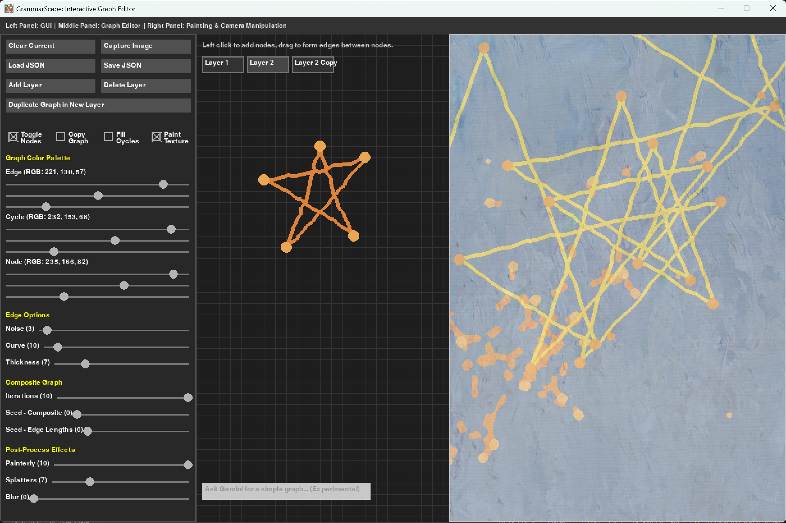
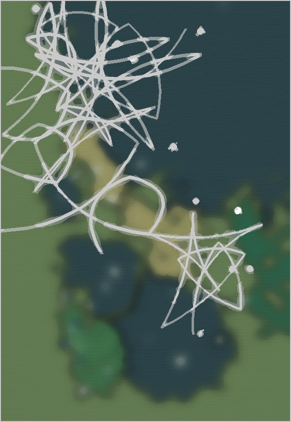
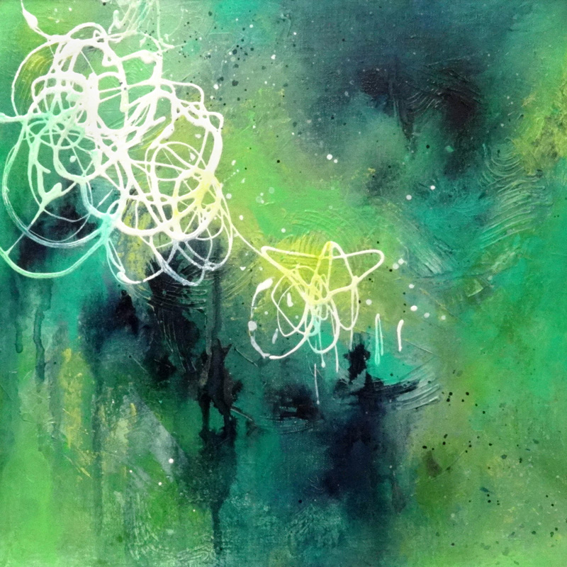
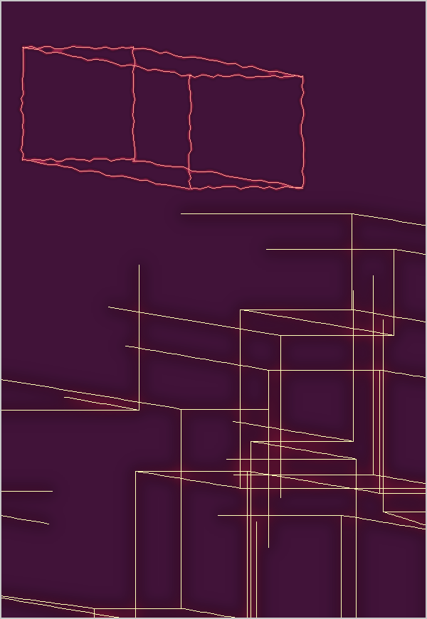
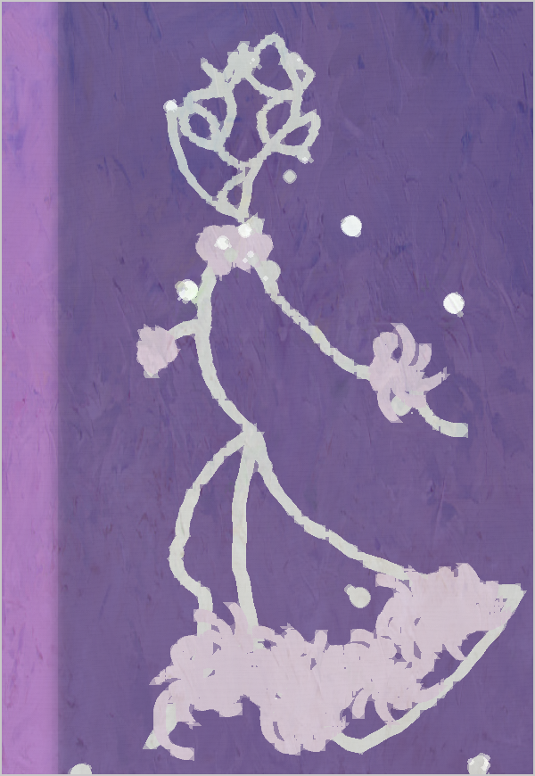

# GrammarScape: Interactive Graph Editor 
**Yuhan Liu** DMD Senior Design Project (Spring 2025)

GrammarScape is an interactive tool for creating, editing, and visualizing abstract graph-based art through procedural techniques. Built with Python, GrammarScape allows users to construct base graphs, expand them procedurally into complex compositions, and apply painterly post-processing effects. Inspired by Paul Merrell’s 2023 SIGGRAPH paper [Example-Based Procedural Modeling Using Graph Grammars](https://paulmerrell.org/wp-content/uploads/2023/08/ProcModelUsingGraphGram.pdf), GrammarScape blends structured graph generation with intuitive creative control, offering an accessible platform for digital artists, procedural content generation (PCG) enthusiasts, and creative coders.

## Features

- **Interactive Graph Editing:** Create and connect nodes on a grid-based canvas with intuitive mouse controls.

- **Procedural Expansion:** Automatically build composite graphs from your base graph, including cycle detection and edge intersection handling.

- **3D Perspective & Camera Controls:** Explore your graphs with adjustable camera zoom, yaw, and pitch to view your composite graphs in 3D space.

- **Painterly Post-Processing:** Apply oil-painting stylization, Gaussian blur, paint splatter overlays, and canvas textures.

- **Multi-Layer System:** Organize and blend multiple graph layers independently to build richly textured, multi-depth compositions.

- **AI-Assisted Graph Generation:** Use natural language prompts to request simple graph structures via Gemini API integration.

## Example Paintings

Roberta Kiphuth's "Scribbles: Falling Star"             |  GrammarScape Painting Inspired by Reference
:-------------------------:|:-------------------------:
  |  

A geometric painting demonstrating layering and expansion: the prism in the top left is copies, whereas the prism design in the bottom right is extended. 

An abstract depiction of a woman, generated using two AI prompts ("woman's head" and "dancer's body") and composited together with edge transformations to create a dynamic, flowing form.

## How to Use

1. Launch GrammarScape: Run the main Python script (e.g., GrammarScape.py).

2. Build Graphs: In the middle panel, left-click to place nodes, drag to connect edges, and right-click to delete nodes.

3. Edit Procedural Parameters: Use the left GUI panel to adjust color, thickness, noise, expansion settings, and post-process effects.

4. View Composite Graphs: The right panel displays procedurally expanded graphs with applied painterly effects. Use the mouse to pan, zoom, pitch, and yaw.

5. Manage Layers: Create, duplicate, and switch between graph layers to organize complex paintings.

6. Generate AI Graphs: Use the text box at the bottom to request simple graphs by describing them in natural language (e.g., "star", "cube").

7. Save and Load Projects: Save your work as JSON files and reload full projects including graph structures and visual styles.

## Development

GrammarScape adapts Paul Merrell’s 2023 graph grammar expansion methods while emphasizing accessible graph creation, intuitive layering, and painterly abstraction. It combines a modular Python architecture with Pygame-based UI and OpenCV post-processing to deliver an extensible and expressive procedural art platform.

Read more about developing GrammarScape in my [final report](https://github.com/yuhanliu-tech/GrammarScape/blob/main/grammarscape_report.doc). 

## References

* Merrell, Paul. Example-Based Procedural Modeling Using Graph Grammars. SIGGRAPH 2023.
