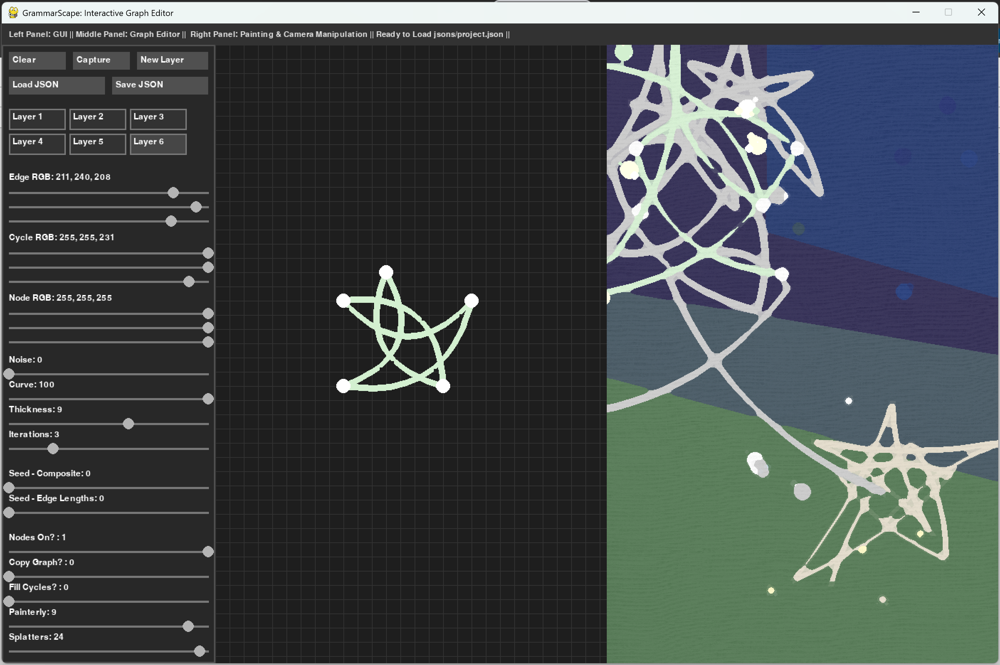

# GrammarScape: Interactive Graph Editor 
# (IN-PROGRESS AS OF APRIL 2025)
**Yuhan Liu's DMD Senior Design Project**

GrammarScape is an interactive graph editor built with Python and Pygame that allows you to create, edit, and explore graphs in a visually compelling and artistic way. With features like composite graph generation, cycle detection, and painterly post-processing effects, this tool transforms simple graphs into dynamic, multi-layered visual experiences.

## Features

- **Interactive Graph Editing:**  
  Create and connect nodes on a grid-based canvas with intuitive mouse controls.

- **Composite Graph Generation:**  
  Automatically build composite graphs from your base graph, including cycle detection and edge intersection handling.

- **3D Perspective & Camera Controls:**  
  Explore your graphs with adjustable camera zoom, yaw, and pitch to view your composite graphs in 3D space.

- **Painterly Effects:**  
  Apply oil painting effects and paint splatter filters using OpenCV to create unique, artistic renderings.

- **Layered Structure:**  
  Manage multiple layers, each with its own graph and customizable settings such as colors, noise, curves, and more.

- **Save/Load Projects:**  
  Easily save your work as a JSON file and load it later to continue your creative process.
